# The Great Total Solar Eclipse of 2024

My personal page of links and info about the eclipse for all the kids and families in my life *in and around the Toronto area*. If you have a question about anything just ask and I can try to add it here.

| Question | Answer |
| --- | --- |
| When is the Eclipse? (if I live near Toronto) | **Monday, April 8, 2024 at 3:19pm EDT**{: .notice--success} |
| How Long is the Total Eclipse? | From **zero** up to **three and a half** minutes, depending where you are. |
|  How about the partial coverage? | About 2.5 hours, from around **2pm to 4:30pm** |

## The Page, 'Tis Too Long, I Refrained from Reading it at all (TL;DR)

1. Get solar eclipse glasses to view the amazing partial eclipse no matter where you are safely. 
2. It's worth it to try to get into the *shadow of totality* so you can see the full eclipse, and take your glasses off.
3. *It's not worth the drive to Buffalo.* 
4. Just try to get as close to the Niagara/Buffalo border as you can. Once you get around the bend in the golden horseshoe, then *going **south** is more important than going **east**.* to get more time in totality. 
5. But nothing is more important than **clear skies** ;) 
6. Have fun, be safe and good luck!

## Summary of Duration of Totality for Various Locations

Note that points between these will vary fairly smoothly as you approach the totality line cutting through downtown Buffalo. Further details below.

| City                              | Duration of Totality                                         |
| --------------------------------- | ------------------------------------------------------------ |
| Toronto                           | 0 seconds (keep your glasses on!)                            |
| Oakville Lighthouse               | 0 minutes 30 seconds (keep walking along the lake what are you doing here!) |
| Oakville       (South Shell Park) | 1 m 6 s (take your glasses off for just one minute of magic!) |
| Hamilton Downtown                 | 1m 43 s                                                      |
| Grimsby (past Hamilton)           | 2 m 47 s                                                     |
| St. Catherines                    | 3 m 6 s                                                      |
| Port Colborne                     | ***3 m 42 s***                                               |
| **USA**                           |                                                              |
| Buffalo                           | 3 m 45 s                                                     |
| Indianapolis                      | 3m 29 s                                                      |
| Dallas                            | 3m 52 s                                                      |
| Fredricksburg, TX                 | 4m 20 s                                                      |

## Other Eclipse Viewing Instructions and Resources

- This great page has lots of [links from the American Astronomical Society](https://eclipse2024.org) about finding the eclipse and viewing it safely.
  
- Take a look at this [Interactive Total Solar Eclipse Map](http://xjubier.free.fr/en/site_pages/solar_eclipses/TSE_2024_GoogleMapFull.html) to zoom in and see whether you are in the Zone of Totality of not!
  
- There's lots more Information from the official [Solar Eclipse Across America](https://eclipse.aas.org/resources/downloads) site with background books, pinhole camera instructions, maps and more.

***Notice**: Due to the madness that is daylight saving's time adjustments, this page previously stated the max eclipse time was 2:19pm, so you've got one more hour!*{: .notice--danger}

# Viewing the Eclipse Safely

Everyone knows that you shouldn't look at the sun directly for more than a second. But during a Total Solar Eclipse there is a few minutes where you really can look at the sun, because the Moon is covering it completely! Now, **Toronto itself won't get a total solar eclipse, so you'll need to keep your glasses on if you stay in town**, or build a solar camera! Here is some information about safe viewing of solar eclipses to go with your glasses.

## Safety Page from the American Astronomical Society

- See this [Eclipse Safety Page](https://eclipse.aas.org/eye-safety) for lots of useful information about how to view the eclipse safely.
- Solar glasses instructions : https://eclipse2024.org/instructions/translations/English.pdf
- **If you are in Toronto** or anywhere else that is **not on the path of totality**, then read on to see how you can make a pinhole camera!

## Easy to Make Pinhole Camera for Kids

### The Basic

Some fundamental information on how to make a pinhole camera instead, here's how](https://eclipse.aas.org/eye-safety/projection)! This page from NASA tells you [how to make a simple pinhole camera](https://www.jpl.nasa.gov/edu/learn/project/how-to-make-a-pinhole-camera/)  with just paper, alumnium foil and tape, so you can see the full shape of the sun as the moon slowely covers it up.

### The Mod

You can improve the view you get from that using a big box to make it darker. 

These [instructions from Sky and Telescope](https://skyandtelescope.org/observing/celestial-objects-to-watch/how-to-watch-a-partial-solar-eclipse-safely/) give some information on how to make your own safe, peronsal solar observatory:

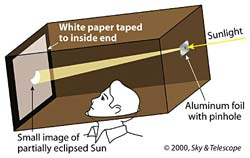

### Getting Fancy...

If you want to see the shadow the sun a bit bigger, you'll need some kind of lense in the pinhole to make the image bigger, and focus it on the right spot to be clear. You could also use binoculars as your lense to project it outwards and just look at the picture. The [instructions from Sky and Telescope](https://skyandtelescope.org/observing/celestial-objects-to-watch/how-to-watch-a-partial-solar-eclipse-safely/) give a bit more information. 

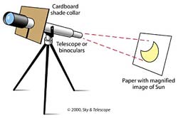

# Can you See the Eclipse from Where you Live?

Every total solar eclipse is amazing, but this year's one is special because it just happens to pass over where so many people live! If you are lucky to have a clear sky, then you can use this [Interactive Map of the 2024 Total Solar Eclipse](http://xjubier.free.fr/en/site_pages/solar_eclipses/TSE_2024_GoogleMapFull.html?Lat=43.76317&Lng=-79.74578&Elv=232.0&Zoom=10&LC=1) to find out exactly what time to elcipse with start and end where you are that day.

## Toronto

Toronto will *not* get an actual total solar eclipse, only what is called an *Annular Solar Eclipse*. This means the will be partially covered by the moon, but never entirely blocked. If you look at the sun through your special solar viewing glasses, it will look like a Cookie Monster has taken a big bite out of the sun! 

Since **the raw sun will be still visible in Toronto**, you  **ALWAYS NEEDS TO USE** to view the eclipse directly in Toronto. But also take a look at making your own ***Pin-hole Camera!*** (see instructions and links below)

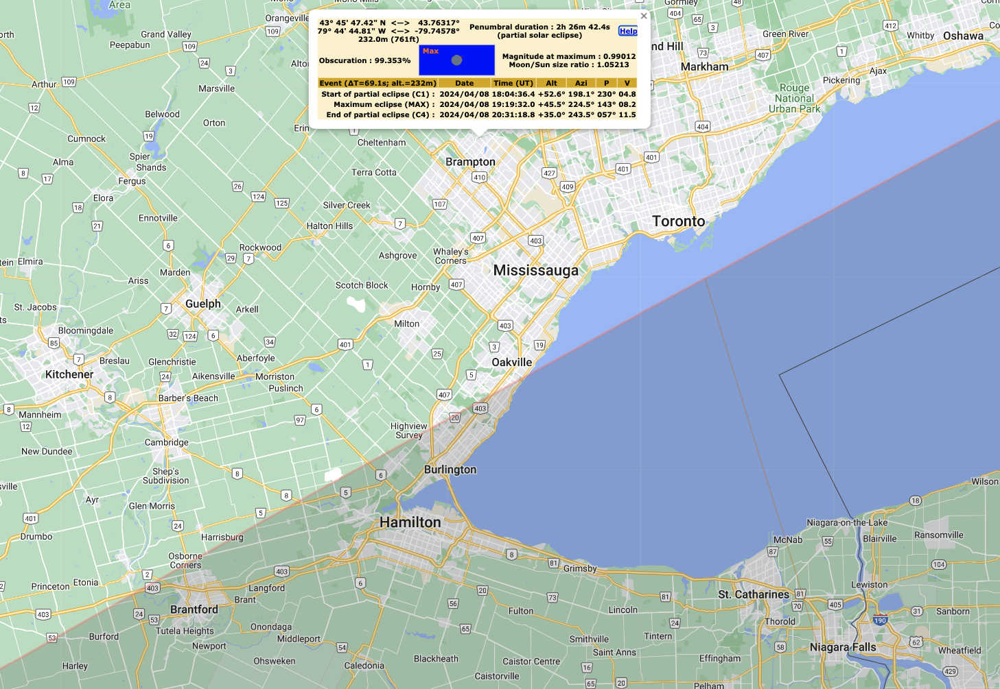

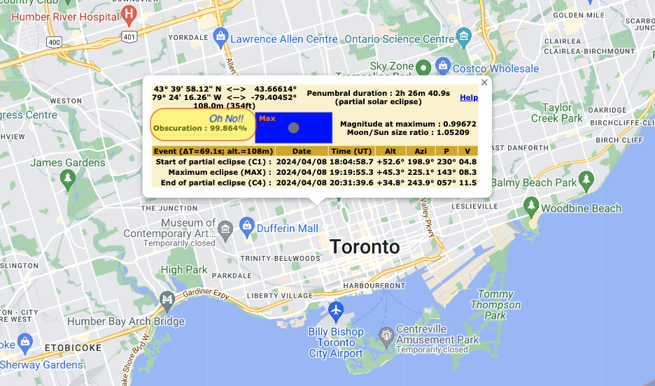

### Toronto zoom



## Oakville

The closest place near Toronto that will actually get Totality, weather permitting, is Western Oakville by the lake.

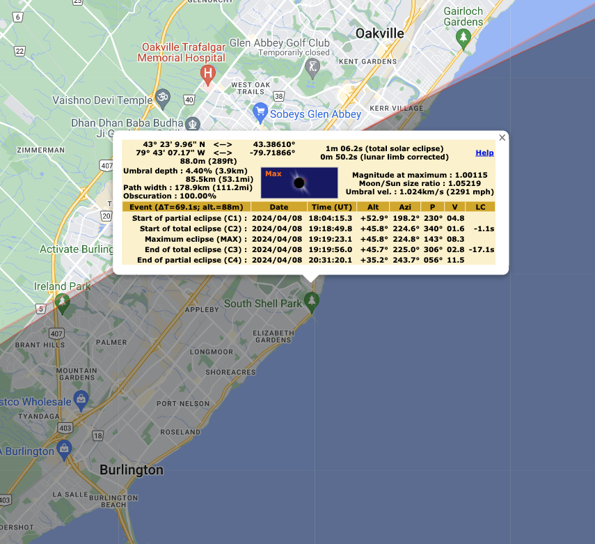

## Understanding the Data Tables

Let's look at the Oakville Data table from the map website to understand what it's telling us.

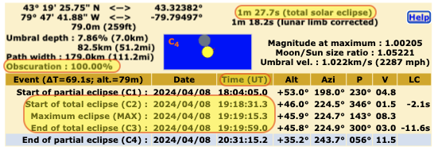

Look at the areas highlighted in red and yellow for the most important information:

| In the Table     | What is it?                                                  | What does it mean?                                           |
| ---------------- | ------------------------------------------------------------ | ------------------------------------------------------------ |
| "1m 27.7s"       | Duration. How long the eclipse will be at that spot.         | 1 minute and 27.7 seconds of Totality!                       |
| Obscuration 100% | How much of the sun is covered by the moon.                  | If this is 100%, then you have a full Total Solar Eclipse! Note that toronto only has |
| C2               | The moment with the last piece of sun is covered by the moon. | It's now safe to look at with your eye's unprotected at this location. |
| UT               | Universal Time                                               | The times are given in UT/Zulu/GMT time. So you need to subtract **4 hours** to get the time for Toronto on Easter Daylight Time.  So, the total eclipse starts at **3:19 pm**. |
| MAX              | The middle point of the total eclipse.                       | Still safe to look! Do you notice how the air is colder now? Are the birds acting funny? |
| C3               | The sun is about to peek back out, the moon has moved on.    | Time to look away or put your glasses back on!               |

**Other Information in the table:**

| In the table | What is it?                                                  | What does it mean?                                           |
| ------------ | ------------------------------------------------------------ | ------------------------------------------------------------ |
| C1           | "First Contact", the first moment the moon covers any of the sun. | Only look at it with your eclipse glasses on! But you should start to see a bigger bite being taken out of the sun. |
| C4           | Last contact, the moon is now no longer in front of the sun at all. | Just a normal day Earth, sigh.                               |

## Going Further from Toronto

So technically, I guess Kerr Village in Oakville gets the first bit of totality. If it's clear skies there you'll just 30 seconds of totality. Just enough time to take off you glasses, see it, and put them back on.

But if you're getting in the car anyways...you might as well go a bit futher :)

### Grimsby

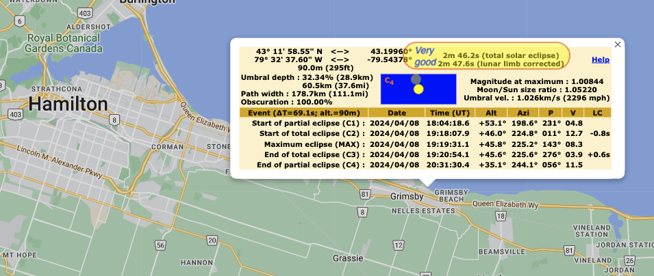

### St. Catherines

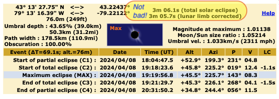

### Port Colborne - Maybe the best spot in Canada? weather permitting

Again, the *only thing that matters* is clouds. If there is no clear sky then it's not worth the trip anywhere. But if you are driving somewhere, the longest duration total solar elcipse anywhere in Canada will be around Port Colborne near Buffalo.

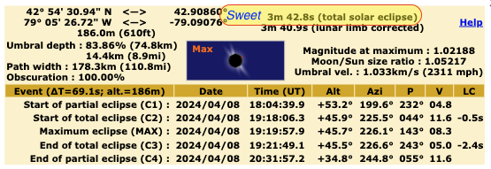

Yes...even better than Point Pelee which is further south, but not as near to the line of totality.

### Buffalo - whole city in full totality, longest duration line cuts through downtown

Niagara Falls itself or Buffalo would be neat, because the whole of the entire cities will have a total solar eclipse. Buffalo gets you even closer to the MAX line, but don't rush there yet...

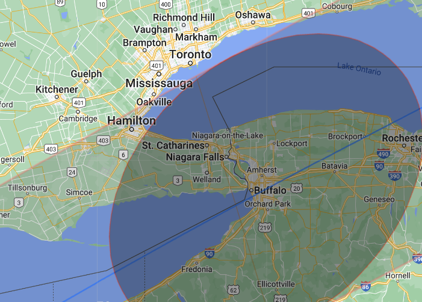

Notice, that Buffalo gets only *3 seconds* more totality time than Port Colborne, and only *40 seconds* more than St. Catherines, which still gets 3 minutes and 6 seconds. That, on top of the unimaginable traffic madness at the border (and everywhere?) that day means **it's not worth the drive to Buffalo**.

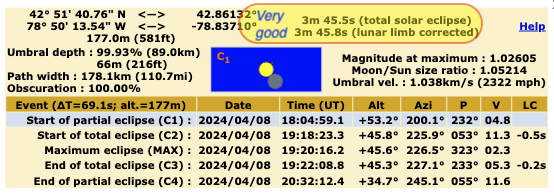

## Other Places of Interest

Ask me and I'll add up info for any places people want, all from the [interactive map](http://xjubier.free.fr/en/site_pages/solar_eclipses/TSE_2024_GoogleMapFull.html?Lat=32.76718&Lng=-96.79552&Elv=141.0&Zoom=11&LC=1)

### Indianapolis

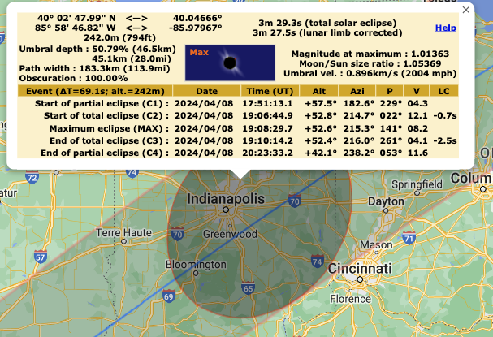

### Dallas

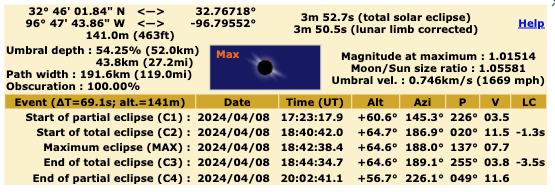

## Fredricksburg, Texas

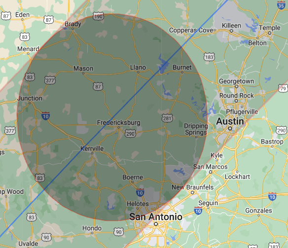

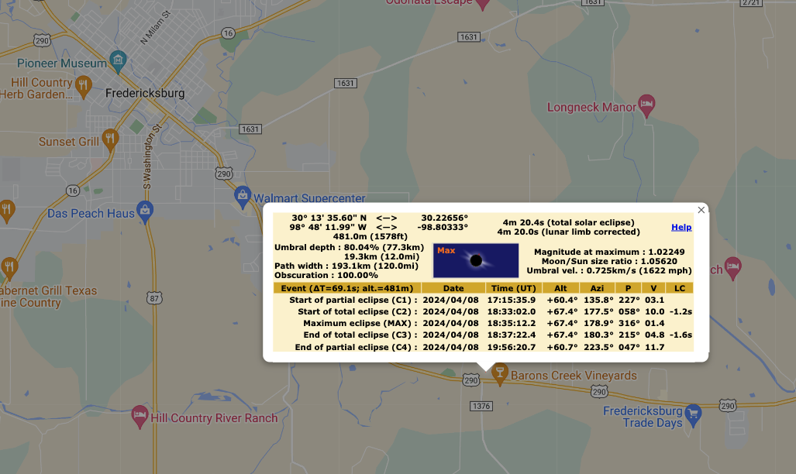

# Questions About the Eclipse

## So, will *you* be able to see the eclipse?

This [google map from Xavier Jubier](http://xjubier.free.fr/en/site_pages/solar_eclipses/TSE_2024_GoogleMapFull.html) lets you check different total solar eclipses against a precise location.

## When is the *Next* Next Eclipse?

- You could catch it 2026!
  - In Spain, say at [Camino de Santiago](https://en.wikipedia.org/wiki/Camino_de_Santiago#Compostela)
  - Or in Iceland

- Or how about  [Luxor, Egypt](http://xjubier.free.fr/en/site_pages/solar_eclipses/TSE_2026_GoogleMapFull.html) in August 2027 for 6 minutes 22 seconds of totality! 
  - Also passing through the Rock of Gilbraltar, and much of Northern Africa.

- [Interactive maps for all future eclipses](http://xjubier.free.fr/en/site_pages/SolarEclipsesGoogleMaps.html)

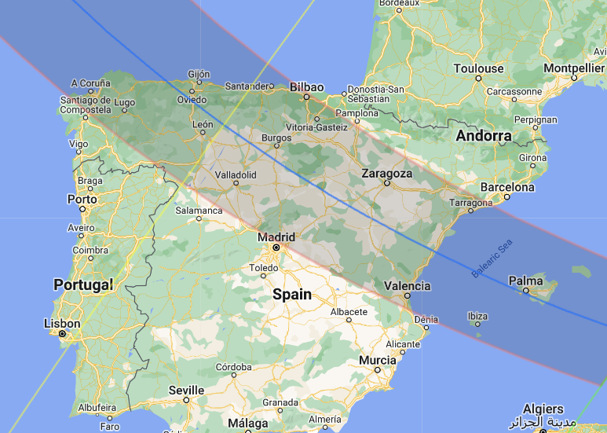

# Colouring Pages

## Your Ontario eclipse Neighbourhood

- [printable pdf](../assets/eclipse/zoom-toronto-v2.pdf)
- [viewable png](../assets/eclipse/zoom-toronto-v2.png)

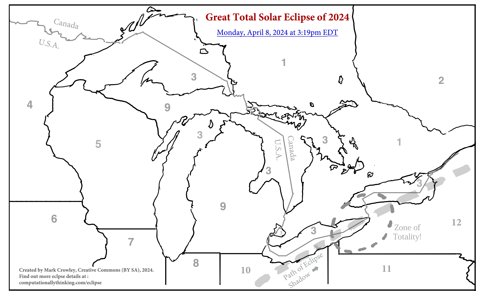

