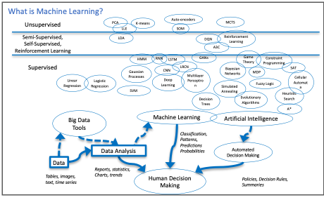
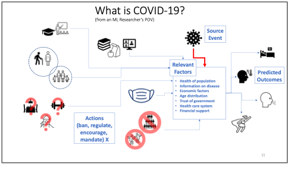
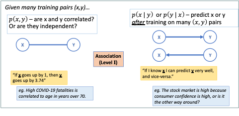
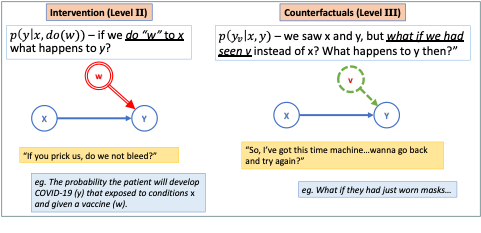

# Abstract

Machine Learning is a very popular and very powerful set of analytical and algorithmic tools for helping human beings understand complex datasets and to take action to achieve their goals. This article will attempt to provide some perspective on the relevance of Machine Learning research for the global struggle with the Covid-19 disease, including understanding how machine learning practitioners and researchers view the usefulness of their toolbox and how they approach a problem such as Covid-19. An interesting fact about the current widely available ML tools is that they are especially good at one particular type of learning, supervised learning, where full knowledge of the “correct” inputs and outputs for the problem are fully known. This is a well-known limitation, which many ML researchers are working hard to rectify, but it means that it is often difficult to ML methods to answer questions in a field such as medicine where the datasets are often small and the amount of full knowledge, labelled input-output data needed is even smaller. There is a vocal, and growing, community within ML research that argues that in order to be truly beneficial to scientific pursuits and society at large, what is needed is for ML to have a greater focus on *causality*. We provide a basic introduction to the idea behind the causal hierarchy and how the existing ML methods relate to it.

# What is Machine Learning?

They say that when all you have is a hammer, then all the world is a nail. For machine learning (ML) researchers and data scientists, aiming to help the world adapt and respond to the Covid-19 pandemic, the currently popular hammer is called Deep Learning. But in fact, there is a whole toolbox to available to be used and knowing which to choose requires knowledge about the tools and the domain itself. The potential impact ML methods can have here is tremendous, but so are the challenges, since a rapidly changing pandemic involves a number of very difficult questions and constraints that most other domains, where ML is famously being used, do not have. 

 

| **Figure 1:** An overview of the pipeline from data to human decision making which includes AI/ML and many specific algorithms which are applicable depending on the datatype and situation.|
| :---: |
|  |

If we start at the beginning, we have to ask what range of techniques and concepts are we talking about when we say, “Machine Learning”, and how do its practitioners see a problem such as the Covid-19 pandemic? Figure 1 provides my own overview of the virtual pipeline from data to human decision making which is the entire point of the study of ML and more broadly, Artificial Intelligence. Data can come in many forms, such as numerical tables, continous signals, gigabytes of images, natural language text documents, etc. For each type of data there are customized ways of preparing, cleaning up, and extracting the essential, or most representative, information to be used for further tasks. There are many specific algorithms which are applicable depending on the datatype and situation. While the field looks vast and complex, there are really only a small number of concepts, or metaphors, underlying most of these algorithms: projections across high dimensional spaces, linear weighted functions with free variables to tune, trees that divide the data dimensions interactively. Of course, most popular right now are models using neural networks, which essentially take the linear weighted functions idea to a combinatorial extreme and add non-linear activation threshold. These are reminiscent of firing neurons triggering in the brain, almost drastically less complex. 

Regardless of the metaphor used, all of these approaches can be thought of as boxes that take inputs data instances (images, patient records, sensor readings,…), represented somehow as a collection of numbers, and produce an output, a collection of numbers which can be interpretted as new data or probabilities. There are two important points to notice here. Firstly, there are many more methods in the “supervised” category of algorithms. Secondly, all of these methods are really meant too help humans make decisions in the end. It is easy to become focussed on the particular abilities and outputs of each algorithm or framework. However, when we chose the tools we are going to use and design this pipeline from data to actionable information, somewhere along the way we should ask ourselves “What does the human decision maker actually need? Is there any way to provide that?”

## What is COVID-19 to a Machine Learning researcher?

From the point of view of an ML researcher or data scientist, addressing with Covid-19 amounts to a very challenging problem of gathering widely distributed, and diverse datasets, full of confusing variations in standards, full of uncertainty and errors. Then the task is to make *very important predictions* about outcomes to *incredibly complex systems* which are *not even fully understood* by the scientists studying them. To which most AI/ML people would say, “great!”, we love nothing more than *almost* impossible problems. In a way, that’s what the pursuit of Artificial Intelligence is all about.

However, in the interest of being a bit more practical, there are two aspects here that we’ll highlight. The first, is that we don’t *need* to have AI/ML solve this problem fully in order to help people, today, on the ground. This fact is exemplified by the kind of practical work being doing by many researchers already, including ourselves. The second point, is that in order to go beyond these short-term, practical solutions to parts of the problem, we may need to rethink what ML is good for and what we actually need.

| Figure 2 : A cartoon schematic of how COVID-19 can be seen as a process to analyze and learn about as a machine learning researcher. The tasks of predicting outcomes and choosing appropriate public policy actions are part of a complex web of factors, some of which are very hard to gather data about and to quantify. |
| :---: |
|  |

## How AI and ML are being used right now?

The fruits of AI/ML research are being used right now for very practical, on-the-ground tasks using approaches that don’t necessarily require very complex AI/ML algorithms:

·   *Spread Prediction:* Improving prediction spread models in one region given model of disease using in-region data. For example, in summer 2020, our lab at Waterloo contributed to an improved regression model for prediction of ICU patient levels in Trillium/Peel region hospitals.

·   *Mutation:* Analyse genetic variation patterns in the disease as it mutates.

·   *Logistics:* Predict and manage shortfalls and of hospital supplies such as PPE, cleaning supplies and basic medicines. 

Of course, more complex challenges and potential solutions exist than these. A particularly promising approach in the prediction/design category is *Anti-viral drug discovery* which attempt to aid the search for promising chemicals to test in various stages of drug development to speed up the process. Researchers in Mila[[1\]](#_ftn1), the machine learning institute in Montreal, are carrying out research on this with projects on learning relationships between drugs, chemicals, proteins on the outcome for good drugs. The main idea is to use machine learning models to propose new candidates, test them in large experimental setups, perhaps even using robotic drug labs. Data from these tests are then fed back into the ML models. Eventually, once confidence in a candidate is high enough, and after extensive human evaluation of the proposal, the decision could be made to try out clinical trials for the best candidates. In the future, this approach could become even more interactive, using machine learning methods such as Reinforcement Learning to design new molecules which could be useful drugs.

## Machine Learning’s Dirty Not-So-Secret

Machine Learning is powerful, it’s defeating world champions at their own games, it is being used to fly spaceships, drive cars. It is also optimizing addictive click-ability of social media apps and advertisements *really, really well*. ML is even recently making progress on solving the mind-bogglingly complex challenge of protein folding! What people don’t say out loud as often, is that all of these wonders come almost all entirely from *associations*! Recall the scientist’s primary warning: “Correlation does not imply causation”. Well, that applies to the majority of supervised Machine Learning approaches, including Deep Learning. It turns out that with enough labelled data, and enough free parameters, correlation, or association if you prefer, is usually very learnable. The question is, what if we wanted more? What if we actually wanted a causal model? 

# Multiple Routes to a Causal Model

Causality is at the very core of the scientific pursuit, so it’s not surprising there are many different ways of approaching it in a reliable, and repeatable way.

The methods of *hypothesis testing*, also referred to as significance tests, are a core method for many scientists. Often simply referred to as “Controlled Experiments”, these are good approaches for direct and critical causal questions such as, in this case, “Is this vaccine effective at reducing severe outcomes?” or “Do masks make a significant difference in spread rate?”. A controlled experiment means that you attempt to determine a *causal link* by *controlling* the input population to be "identical". Note that "identical" here only means "identical for all relevant variables". So, for example, if you know that hair colour does not have any impact on the question being studied, then you would not need everyone in your data to belong to the same hair colour group. Since identical examples are often not available, we can weaken this slightly and insist the data are all independently sampled from a known distribution.

The drawbacks of these approaches are their rigid restrictions on allowed questions, their reliance on known questions, and their intuitive difficulties which can lead to confusion and misuse. This inflexibility makes them less useful for answering the following kinds of questions where we cannot run a controlled trial for practical or ethical reasons:

·   Should we close restaurants and gyms? 

·   Or should we have closed schools instead? 

·   Or maybe we should have kept them all closed longer in the first place?

 

## Tiptoeing Towards Causality

A more direct, interventional approach is used in vaccine trials under the title of “Human Challenge Studies” (Walker, 2020) where healthy volunteers are given an experimental vaccine under review and then, once the immune response is expected to be high, say as a month later, to *purposely be infected* with active virus to see the effect. This is done in a controlled a manner, but it is indeed a case of making your patient sick in order to test out your cure. From the perspective of causal, scientific practice, this is really the gold standard for determining the causal effect of some action. In physics and chemistry, it is the *only way* to determine causal relationships. In medical problems, it is usually necessary to find ways to *infer causality,* as well as possible, using less direct methods. 

## A Note on the SIR Model

The classic approaches for epidemiological study and practice are models such as the *susceptible-infected-removed (SIR)* (Kermack, 1927) model for spread of a virus in a community. These are ODE models that capture the essential, *statistical* behaviour of a virus and how it spreads across the population. 

However, these assumptions are quite extreme, such as fixed population and structure, as well as rigidly defined incubation period and infectivity durations.

Now, these ODEs are inherently already causal. They define how we understand disease to spread from in a population and how distance, risk profiles viral load and recovery/death rates. However, these are also *very simple* models, they cannot *learn what these relationships should be* from data. They cannot easily be made to include specific information which we have become so used to discussing now such as the comparative impacts of re-opening various types of services and businesses, such as: exercise gyms, restaurants, or schools. They do not even model the impact of various mask wearing policies directly. There are many other, more advanced forms of SIR that overcome some of these limitations. For example, SEIR (Carcione, 2020) adds an “Exposed” step to the model. The SEIR model uses information such as birth and death rate, specific fatality rate caused by the virus directly or indirectly. The probability of transition for every contact between two people, rates of disease incubation progress and recovery for individuals.

## The Causal Hierarchy

A different approach to understanding causal relationships comes from a well-known figure in the field of Artificial Intelligence, and Turing Award winner, Judea Pearl. Pearl describes **the causal hierarchy** as a general relationship between *data, labels, knowledge and causality* (Pearl, 2009)*. 
\* The hierarchy has three levels: 

​        I.     Association – passive observation

​       II.     Intervention – active experiments, interventions

​      III.     Counterfactuals – retrospective analysis, what-if scenarios

 

These three types of data relationships are described in the Figures 3 and 4 both visually and with the mathematical notation Pearl uses which connects causality directly to conditional probability theory. Pearl was a central figure in the invention of *probabilistic graphical models* including the widely used Bayesian Network (Pearl, 1988). Even in that seminal paper, he put forward the importance of these models not only prediction and interpretation but also for inferring causal relationships in a system that might not otherwise be discernible, this can have many different uses in modelling some of which are surprising (Crowley, 2013). The “ball and stick” graphs in Figures 3 and 4 are small examples of these graphical models and show one way to represent the three levels of the causal hierarchy. Suffice it to say that Level II reasoning is more difficult to do thank Level I, while Level III is often difficult for people to intuitively grasp, let alone build automated models to do this reasoning on our behalf.

| Figure 3: Visual depiction of Level I of the Causal Hierarchy as graphical models. Most Machine Learning results are restricted to this type. |
| :---: |
|  |

| **Figure 4:** Visual depiction of Levels II and III of the Causal Hierarchy as graphical models. Some Machine Learning result in Decision Making and Reinforcement Learning fall in to Level II, very few methods deal with Level III.|
| :---: |
|  |

While causal Inference methods are fairly new, they are being used in fields where causal answers are critical, such as medicine, infectious disease control, safety critical systems. However, in Machine Learning they are not in the “hot” category right now. Deep Learning does not easily answer these questions, or at least, researchers in Deep Learning have not focussed much on enable such abilities. COVID-19 is a perfect moment to explore this further and see what can be achieved on a problem with a lot of data and where causal inferences will actually be critical to success.

# Using the Experiment That We Already Have…

The global response to COVID in each country, region and city is like **a thousand different experiments** being carried out at once on the same problem. These experiments are, of course, controlled by each region, but they are not *controlled experiments* in the statistical sense, as we discussed earlier. A critical part of being "controlled" also is that *interventions*, or actions, are taken which affect the outcome. The whole goal of the experiment is to determine if the intervention has a notable effect which cannot be explained by anything else. This means that we cannot just take the results from Sweden (for example, where there was no mask mandate for many months in 2020) and make inferences about a Province in Canada without doing the following:

1.   Matching the factors in common in both populations.
2.   Analysing the differences and adding that to our model.
3.   Using a causal graph structure to work out which questions can be answered based on whether the same actions were taken in both sitations.

## Let a Thousand Experiments Bloom

So, a grand challenge for Machine Learning in this situation could be put forward based on three questions:

1.   Can we *collect and sensibly represent* intervention data, all actions taken against COVID-19, by all levels of government, in different countries and regions?
2.   Can we *fuse* all the demographic, economic, even socio-political information we have into a single, seamless database?
3.   Finally, can we then learn a *useful* model that explains the differences in outcomes automatically? 

One of the first questions we should always ask in a data analysis problem is “What are the relevant factors to our target question?” In the case of COVID-19 the usual biological and medical factors are being well-used already. But we’ve all seen how other factors are hugely influential on the way the disease spreads on the ground in any given region or country. 

Some of the critical, and difficult factors not always being used include: 
- demographic factors
- detailed age distribution
- health care system setup 
- systemic racism, history of trust/distrust of government by segments of the population
- size of minority groups
- local temperature, season, weather
- wealth disparity in general
- group-specific education levels
- societal wealth gap
- dominance of anti-establishment feelings, resistance to strict central rules
- anti-vaccine culture
- religious control of state?

These are often difficult factors to define and measure. But they are real, societal factors that could explain why the same control policies don't have the same effect in different regions. There’s no reason these factors can’t be modelled, but it requires sociological expertise and causal inference to use this information fully.

It is clear there are many factors which could influence reducing the spread of the SARS-CoV-2 virus and the impact of the COVID-19 disease. The most complex epidemiological models are still much simpler than the reality. That is as it should be, since this is the only way to hope to understand the individual factors and to see what kind of data is missing. However, the world is currently undertaking a program of massively parallelized, unintentionally varied, experiments in every country and region of the world as we try to tackle the effects of this deadly disease. This offers us an opportunity for learning more, if we can use the data well. 

Of course, the opportunities and challenges, don’t stop there either. Beyond modelling of virus spread and reduction strategies, the same ideas can be used to consider the possible influence factors on vaccine effectiveness itself. This will include Medical and Epidemiological factors such as the particular mutation, the viral load in the population, the susceptibility to infection and serious outcomes of the population. Further, logistical factors will come into play which apply equally at national, regional, and local levels. This includes the political will to distribute vaccines in the most logical way, and the ability to produce, or obtain from others, enough vaccine and to distribute it. Finally, societal factors will also apply, as they have with the strategies to mitigate spread of the disease in the first place. Some members of the public may not be willing to take the vaccine, or it may be difficult to reach or inform everyone about the proper ways to remain healthy until the vaccine deployment reaches where widespread immunity can actually impact the risks of daily life

This is partly a massive exercise in data organization and extraction. Much of this is being done already, the *Oxford COVID-19 Government Response Tracker* (Oxford, 2021) database being the most notable example. Doing this well will also requires being able to answer all three levels of questions in the causal hierarchy.

# Conclusion and Next Steps

The main point of this article was to highlight how Machine Learning is being used and potentially could be used to do some small part to get humanity through this pandemic. Finally, it is important to remember, in this era of extreme hype in every area of human endeavour, that any analytical method or algorithm, no matter how advanced, is still usually only good at very specific types of questions. For ML to be useful the *right questions* need to be asked and the *data being used needs to align* with those questions in some way. In other words, it needs to be reasonable that *the answer* being sought is actually contained within that data, even if it is deeply hidden. No algorithm can produce information from nothing. Additionally, for the most popular Machine Learning algorithms, most of those questions that they are good at are associational in nature, not causal. So, if we assume that the causal relationships between our mitigation, treatment and vaccination actions and their outcomes is the goal, then we need to expand our idea of what Machine Learning means to include methods such as causal inference.

 

# References

J. Pearl. *Probabilistic Reasoning in Intelligent Systems: Networks of Plausible Inference.* Morgan Kaufmann, San Mateo, California, 1988.

J. Pearl. *Causality: Models, Reasoning and Inference.* Cambridge University Press, 2nd edition, 2009.

J. Pearl, “The seven tools of causal inference, with reflections on machine learning,” Communications of the ACM, vol. 62, pp. 54–60, Feb. 2019.

D. Poole and M. Crowley. “Cyclic causal models with discrete variables: Markov chain equilibrium semantics and sample ordering.” In *IJCAI International Joint Conference on Artificial Intelligence*, pages 1060–1068, Beijing, China, 2013.

J. M. Carcione, J. E. Santos, C. Bagaini, and J. Ba. “A simulation of a covid-19 epidemic based on a deterministic SEIR model.” *Frontiers in Public Health*, 8:230, 2020.

A. Walker and S. Boseley, “UK Covid1-9 vaccine trial set to infect healthy volunteers with virus,” *The Guardian Newspaper*, September 23, 2020.

W. O. Kermack and A. G. McKendrick, “A contribution to the mathematical theory of epidemics,” *Proceedings of the Royal Society of London.* *Series A, Containing Papers of a Mathematical and Physical Character*, vol. 115, no. 772, pp. 700–721, 1927. 

Univ. Oxford, Blavatnik School of Government. “Oxford covid-19 government response tracker (OxCGRT),” 2021. Website: https://www.bsg.ox.ac.uk/research/research-projects/coronavirus-government-response-tracker.
